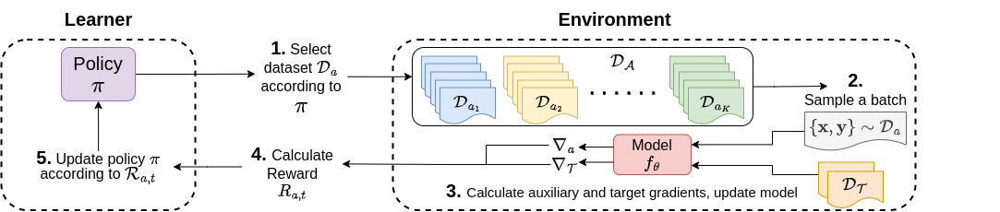

# FLAD - Few-shot Learning with Auxiliary Data

This is the official repository for the 2023 NeurIPS paper: [Improving Few-Shot Generalization by Exploring and Exploiting Auxiliary Data](https://arxiv.org/abs/2302.00674).

## Abstract
Few-shot learning is valuable in many real-world applications, but learning a generalizable model without overfitting to the few labeled datapoints is challenging. In this work, we focus on Few-shot Learning with Auxiliary Data (FLAD), a training paradigm that assumes access to auxiliary data during few-shot learning in hopes of improving generalization. Previous works have proposed automated methods for mixing auxiliary and target data, but these methods typically scale linearly (or worse) with the number of auxiliary datasets, limiting their practicality. In this work we relate FLAD to the explore-exploit dilemma that is central to the multi-armed bandit setting and derive algorithms whose computational complexity is independent of the number of auxiliary datasets, allowing us to scale to 100× more auxiliary datasets than prior methods. We propose two algorithms – EXP3-FLAD and UCB1-FLAD – and compare them with prior FLAD methods that either explore or exploit, finding that the combination of exploration and exploitation is crucial. Through extensive experimentation we find that our methods outperform all pre-existing FLAD methods by 4% and lead to the first 3 billion parameter language models that outperform the 175 billion parameter GPT-3. Overall, our work suggests that the discovery of better, more efficient mixing strategies for FLAD may provide a viable path towards substantially improving generalization in few-shot learning.

## Overview

Few-shot learning with auxiliary data (**FLAD**) assumes access to auxiliary labeled data during learning to improve a model's few-shot generalization.
<br>
This repository contains code to use two FLAD methods (EXP3-FLAD and UCB1-FLAD) on datasets from [P3](https://github.com/bigscience-workshop/promptsource) using models from the [Hugging Face Model Hub](https://huggingface.co/models) based on the [T5 architecture](https://github.com/google-research/text-to-text-transfer-transformer) (including LM adapted T5, T0).
<br>
This repository is set up to be easily adaptable to new models (by altering `src/trainer.py`) and datasets (by altering `src/data/datareaders.py`).

## Getting Started:

<details><summary>Environment Setup</summary>
<br>
First, install python requirements from `requirements.txt` using your favorite virtual environment manager and the appropriate cuda version.
<br>
For example, with conda use:
  
```bash
CUDA_VERSION="113"
conda create -n flad_env python==3.8
conda activate flad_env
pip install -r requirements.txt -f https://download.pytorch.org/whl/cu${CUDA_VERSION}/torch_stable.html
```
  
</details>

## To run our FLAD methods:
 
<details><summary>EXP3-FLAD</summary>
  
```bash
GPU=0
TARGET_DATASET='copa'
bash all_exp3.sh $GPU $TARGET_DATASET
```
</details>

<details><summary>UCB1-FLAD</summary>
  
```bash
GPU=0
TARGET_DATASET='copa'
bash all_ucb1.sh $GPU $TARGET_DATASET
```

### UCB1-specific info
If you wish to use UCB1, you will need to pre-compute gradient alignments. The trainer class in `trainer.py` will compute and cache the values during training, but if you are planning on running many experiments on a large set of auxiliary datasets, such as P3, you may wish to pre-compute gradients and alignments prior to training with our premade script. The script will compute gradients for a model on each auxiliary dataset and cache them for future use, then compute the alignment with respect to a specific target dataset.

  </details>
  
  
Note: If you plan to run many experiments with UCB1 or Exploit-only, it can be useful to pre-compute gradients and gradient alignments.

<details><summary>To pre-compute gradient alignments</summary>
  
You can pre-compute gradients and alignments with:
  
```bash
TARGET_DATASET='copa'
AUXILIARY_DATASET='P3'
python3 src/multirun_create_weight_inits.py --target_dataset $TARGET_DATASET --auxiliary_dataset $AUXILIARY_DATASET
```

***NOTE***: This script will by default pre-compute gradients with base- and XL-sized T5 models, and T0-3B. To change this, edit the variable `MODELS` found on lines 83-88 of `src/multirun_create_weight_inits.py`.
  
  </details>

## To run baselines:
<details><summary>Target-only baseline</summary>
        
```bash
GPU=0
bash target_only_finetuning.sh $GPU
```
</details>

<details><summary>Explore-only baseline</summary>
  
```bash
GPU=0
TARGET_DATASET='copa'
bash all_mixed.sh $GPU $TARGET_DATASET
```
  </details>
  
<details><summary>Exploit-only baseline</summary>
    
```bash
GPU=0
TARGET_DATASET='copa'
bash all_exploit.sh $GPU $TARGET_DATASET
```

*Note*: The exploit-only baseline requires computing auxiliary dataset gradients prior to training.
<br>
This process will take a few hours, depending on your hardware.
 </details>
 
### Attribution
The data loading and formatting code is based on [T-Few](https://github.com/r-three/t-few).

## How to Cite
If you extend or use this work, please cite the [paper](https://arxiv.org/abs/2302.00674) where it was introduced:
```
@article{albalak2023improving,
      title={Improving Few-Shot Generalization by Exploring and Exploiting Auxiliary Data}, 
      author={Albalak, Alon and Raffel, Colin and Wang, William Yang},
      journal={arXiv preprint arXiv:2302.00674},
      year={2023},
}
```
